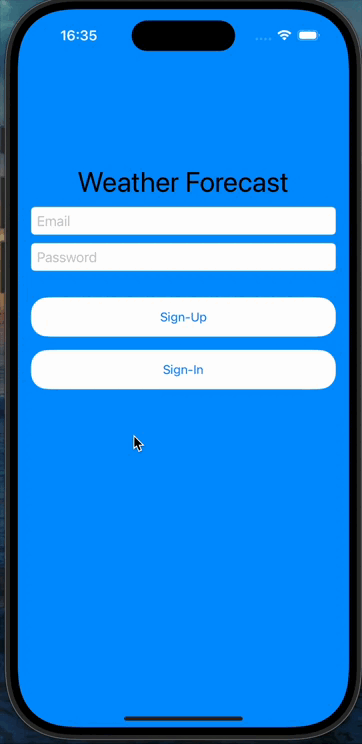
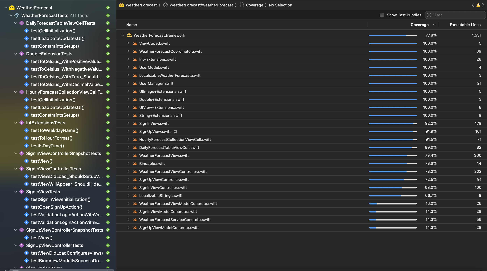
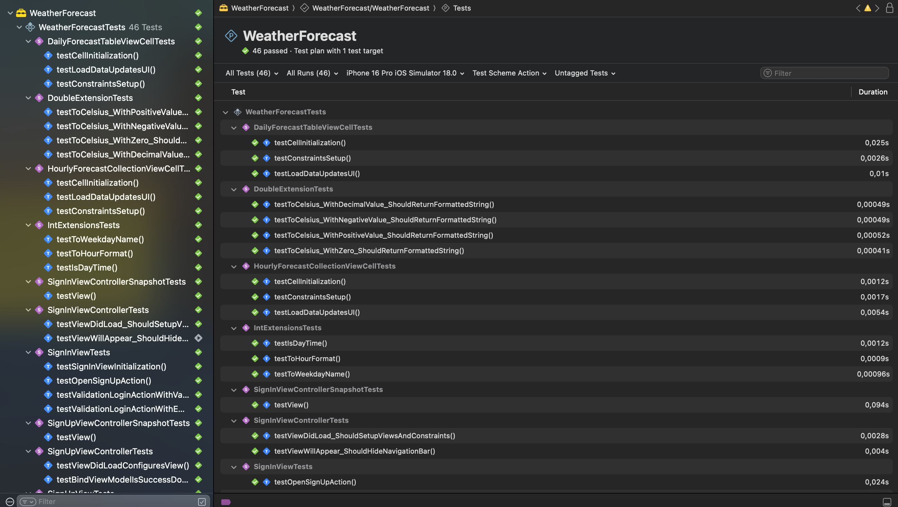
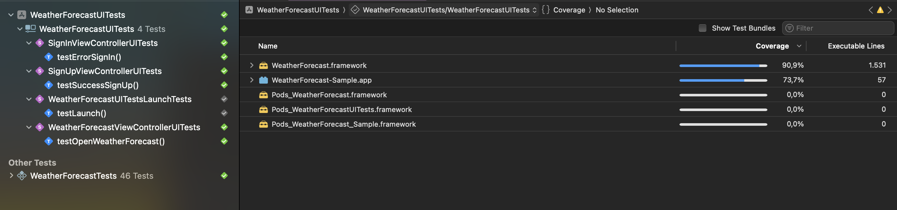

# Weather Forecast App - Swift 6

This project is a basic authentication (login) system developed in Swift 6, using the MVVM-C (Model-View-ViewModel-Coordinator) architecture. The Weather Forecast App is configured with XcodeGen and includes support for unit testing, interface testing, and snapshot testing. Below are the installation instructions and a description of the main technologies and features implemented.

## Table of Contents

- [Requirements](#requirements)
- [Technologies Used](#technologies-used)
- [Screens](#screens)
- [Test](#test)
- [UI Test](#uitest)
- [Features Implemented](#features-implemented)
- [Folder Structure](#folder-structure)
- [Installation](#installation)
- [Troubleshooting](#troubleshooting)
- [Versioning](#versioning)
- [Contributions](#contributions)
- [How to Contribute](#how-to-contribute)
- [License](#license)

## Requirements

Before starting, make sure you have the following requirements installed:

- **Xcode** (Version 16.0 or higher)
- **macOS** (Version 15 or higher)
- **Swift 6**
- **XcodeGen** For project generation.

## Technologies Used

- **Swift 6**: Main programming language.
- **UIKit**: Standard library for building the graphical interface.
- **XCTest, Unit and UI**: Used to do the tests.
- **SnapshotTesting**: For snapshot testing. https://github.com/uber/ios-snapshot-test-case
- **XcodeGen**: A tool for generating Xcode projects from YAML files. https://github.com/yonaskolb/XcodeGen
- **URLSession**: Used to make project requests.
- **MVVM-C (Model-View-ViewModel-Coordinator)**: Architectural pattern used in the project.
- **API public**: https://openweathermap.org/

## Screens

<p align="center">
  
  
</p>

## Test

<p align="center">
  
  
</p>

## UITest

<p align="center">
  
</p>

## Features Implemented

- **Dashboard**: Displaying the weather forecast.
- **Login with Email and Password**: Local credential validation and server integration.
- **Simple and Functional Interface**: Minimalistic design using UIKit.

## Folder Structure

```bash
WeatherForecastApp
│
├── WeatherForecast
│   ├── Assets
│   │
│   ├── Classes
│   │
│   └── Tests
│
├── WeatherForecast-Sample
│
├── WeatherForecastUITests 
│
```

## Installation

## Using XcodeGen

### 1. Install XcodeGen (if you haven't already):

```bash
brew install xcodegen
```

### 2. Clone the Repository

```bash
git clone https://github.com/jovitorneves/WeatherForecastApp.git
```

### 3. Generate the Xcode project

```bash
xcodegen
```

### 4. Open the Project in Xcode

Navigate to the directory where you cloned the project and open the `.xcworkspace` file in Xcode.

```bash
open WeatherForecast.xcworkspace
```

### 5. Run in Simulator or Device

In Xcode, select the target (simulator or physical device) and click the **Run** button (play icon) to build and run the application.

## Troubleshooting

If you encounter a "permission denied" error while running xcodegen, it may be due to insufficient permissions for the current user. Here are a few solutions to resolve this issue:

 1. Check File Permissions: Ensure that you have the correct permissions for the project directory. You can change the permissions by running:

 ```bash
chmod 755 scripts/{change_to_file_name}.sh
```

## Versioning

This project follows semantic versioning:

- **v1.0.0**: Initial release with basic login functionality.

## Contributions

Contributions are welcome! Feel free to open **issues** or **pull requests**.

### How to Contribute

1. Fork the project.
2. Create a new branch (`git checkout -b feature/new-feature`).
3. Commit your changes (`git commit -m 'Add new feature'`).
4. Push to the branch (`git push origin feature/new-feature`).
5. Open a **pull request**.

## License

This project is licensed under the MIT License. See the [LICENSE](LICENSE) file for details.